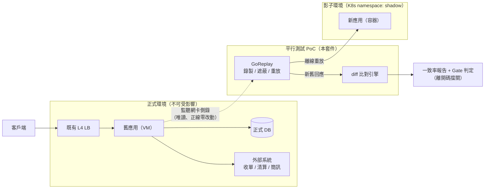
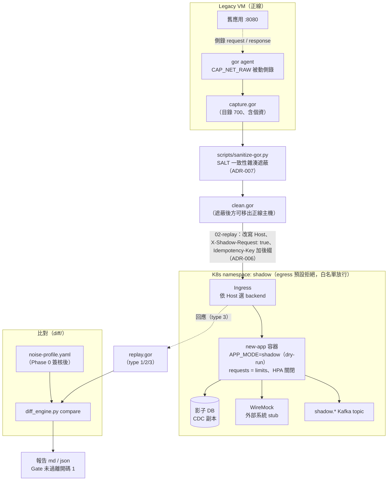
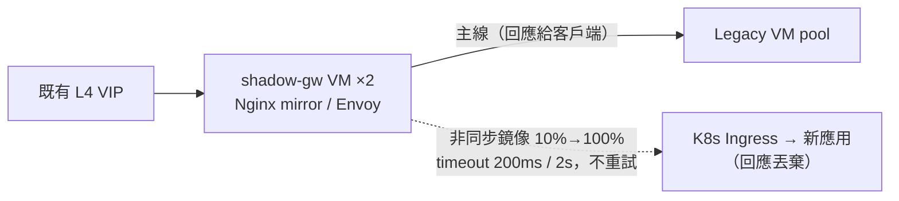

# 新舊應用平行測試 PoC 套件

舊應用（VM）↔ 新應用（容器 / K8s，無 Service Mesh）的功能與性能平行驗證。

---

## 套件結構

```
.
├── README.md                       本檔
├── CLAUDE.md                       給 Claude Code 的專案指引
├── docs/
│   ├── 01-poc-plan.md            主規劃書（架構、階段、風險）
│   ├── 02-work-checklist.md            32 項工作 + Gate 定義
│   ├── 03-verification-report.md       本機端到端驗證報告（53 項全通過）
│   ├── FILEMAP.md                  檔名對照
│   ├── build-deck.js               管理層簡報生成腳本（pptxgenjs）
│   └── adr/
│       ├── ADR-001-traffic-capture-method.md          錄製重放 vs 即時鏡像
│       ├── ADR-002-shadow-gateway-placement.md      VM 側 vs K8s 側
│       ├── ADR-003-side-effect-isolation.md      三層防護
│       ├── ADR-004-noise-baseline-and-diff.md    Phase 0 設計
│       ├── ADR-005-perf-metric-normalization.md        為何不能直接比 latency
│       ├── ADR-006-header-contract.md            shadow header 規格
│       └── ADR-007-pii-masking-and-retention.md      法遵要求
├── scripts/
│   ├── 00-preflight.sh             跨界連通性驗證（W1 必做）
│   ├── 01-record.sh                legacy VM 錄製
│   ├── 02-replay-functional.sh     1x 重放（功能比對）
│   ├── 03-replay-perf.sh           倍率重放（性能驗證）
│   ├── 04-run-diff.sh              比對 + Gate 判定
│   └── sanitize-gor.py             錄製檔個資遮蔽
├── diff/
│   ├── diff_engine.py              比對引擎（compare / baseline）
│   ├── gor_parser.py               .gor 解析
│   ├── normalizer.py               噪音正規化
│   ├── noise-profile.yaml          噪音設定檔
│   └── selftest.py                 自我測試
├── config/
│   ├── vm/nginx-shadow.conf        VM 側影子閘道（備案）
│   └── k8s/
│       ├── envoy-shadow.yaml       Envoy 影子閘道（備案）
│       └── shadow-namespace.yaml   隔離用 Namespace/Quota/NetworkPolicy/Deployment
├── verify/
│   ├── e2e_verify.py               本機端到端驗證（模擬新舊服務走完全流程）
│   ├── Dockerfile                  驗證環境映像（envoy / nginx / kubeconform / python3）
│   └── k8s-isolation/              隔離拓樸執行期驗證（T-14，需 kind + Calico）
└── dist/
    ├── poc-exec-deck.pptx          管理層簡報（由 docs/build-deck.js 產出）
    ├── poc-exec-deck.pdf           簡報 PDF 版
    └── poc-package.zip             對外交付打包
```

---

## 架構圖

依 C4 Model 分層：C1 系統情境、C2 容器（合併部署視角 —— VM ↔ K8s 混合拓撲與
網路隔離是本案關鍵，屬部署層資訊）。C3 僅 diff 引擎有意義（見 CLAUDE.md 模組表），
不另繪圖。

### C1 系統情境圖



### C2 容器暨部署圖（主方案：GoReplay 錄製重放）



### 備案：VM 側即時鏡像（僅當「即時發現差異」為硬需求，ADR-001/002）



---

## 快速開始

### 0. 驗證工具本身可用

```bash
cd diff && python3 selftest.py
```

預期輸出：注入 4 筆真實缺陷全數偵測，196 筆噪音全數抑制。

完整流程可用本機端到端驗證（模擬新舊服務，涵蓋遮蔽 / 基線 / 比對 / Gate）：

```bash
python3 verify/e2e_verify.py
```

各項驗證結果見 `docs/03-verification-report.md`。

### 1. W1 跨界連通性（在 legacy VM 上）

```bash
TARGET_HOST=new-app.bank.internal \
XFF_ECHO_PATH=/api/v1/_echo \
./scripts/00-preflight.sh
```

FAIL 為 0 才可繼續。

### 2. 錄製（legacy VM）

```bash
sudo PERCENT=5 DURATION=60m ./scripts/01-record.sh
```

### 3. 遮蔽個資（移出正線主機前必做）

```bash
export SALT=$(cat /etc/shadow-poc/salt)     # 固定值，勿更換
python3 scripts/sanitize-gor.py \
    /data/shadow-capture/legacy_20260725-090000.gor \
    /data/clean/legacy_20260725.gor --report
```

遮蔽報告零命中時**不得放行** —— 代表規則與實際資料格式不符。

### 4. Phase 0 噪音基線（舊 vs 舊）

```bash
# 先重放到 legacy 第二實例
TARGET=http://legacy-2.bank.internal:8080 \
  ./scripts/02-replay-functional.sh /data/clean/legacy_20260725.gor

python3 diff/diff_engine.py baseline \
    --combined /data/shadow-replay/replay_*.gor \
    --profile diff/noise-profile.yaml \
    --out-profile diff/noise-profile.signed.yaml \
    --gate-false-positive 1.0
```

⚠ 產出的 `ignore_paths` 是**候選**，不是結論。逐條人工簽核後才可套用 —— 自動學習會把「排序不穩定的金額欄位」也列進來，那正是真實缺陷會躲藏的位置。

### 5. Phase 1–3 功能比對

```bash
./scripts/02-replay-functional.sh /data/clean/legacy_20260725.gor
PHASE=1 PROFILE=diff/noise-profile.signed.yaml \
  ./scripts/04-run-diff.sh /data/shadow-replay/replay_20260725.gor
```

離開碼 0 = Gate 通過可推進；1 = 停在原階段。

### 6. Phase 4 性能

```bash
LADDER="100 200 500" ./scripts/03-replay-perf.sh /data/clean/legacy_20260725.gor
```

**判準是應用內部 timer，不是端到端 latency**（見 ADR-005）。

---

## 在 wslc 容器中執行驗證

`wslc` 是 WSL 內建的容器 CLI（Windows 11 的 WSL 2.9 起隨附，路徑
`C:\Program Files\WSL\wslc.exe`），子命令與 Docker 幾乎一致。Windows 上不必安裝
Docker Desktop 即可取得一個乾淨的 Linux 環境。

對本套件的用處是：本機通常沒有 `envoy`、`nginx`、`kubeconform`，設定檔檢查就只能
退回讀字串比對——而那正是會製造假通過的做法（見 `docs/03-verification-report.md`
第 3.11 節：一份 Envoy 根本載不進去的設定，曾因字串斷言而拿到通過）。用容器把
這些二進位補齊，`verify/e2e_verify.py` 第 10 節就會實際載入設定驗證。

### 建置驗證映像

```bash
wslc build -t pt-verify:1 -f verify/Dockerfile verify/
```

### 執行整套驗證

專案目錄以**唯讀**掛載，容器內複製一份再動工，工作樹不會被寫入：

```bash
wslc run --rm -v "<專案絕對路徑>:/src:ro" pt-verify:1 bash -c '
    mkdir -p /work && cp -a /src/. /work/ && cd /work || exit 1
    bash -n scripts/*.sh
    ( cd diff && python3 selftest.py )
    echo "127.0.0.1 k8s-ingress.internal" >> /etc/hosts   # nginx -t 的 upstream 需可解析
    python3 verify/e2e_verify.py
'
```

預期 `verify/e2e_verify.py` 輸出 53/53 通過，其中第 10 節三項為：

```
✅ Envoy 實際載入設定通過（envoy --mode validate）
✅ K8s manifest 通過 schema 嚴格驗證（kubeconform -strict）
✅ Nginx 實際載入設定通過（nginx -t）
```

### 只驗單一設定檔

```bash
# Envoy bootstrap
wslc run --rm -v "<專案絕對路徑>:/src:ro" pt-verify:1 \
    envoy --mode validate -c /src/config/k8s/envoy-shadow.yaml

# K8s manifest（不需叢集）
wslc run --rm -v "<專案絕對路徑>:/src:ro" pt-verify:1 \
    kubeconform -strict -summary -kubernetes-version 1.31.0 \
    /src/config/k8s/shadow-namespace.yaml
```

### 常用管理指令

```bash
wslc images                  # 列出映像
wslc list                    # 列出容器
wslc rmi pt-verify:1         # 刪除映像
wslc pull python:3.13-slim   # 取得映像
```

### 兩個會踩到的地雷

**1. `-v` 的參數要先組成單一字串再傳。** PowerShell 裡直接寫
`-v "$path:/src:ro"` 會把 `$path:` 當成變數名解析，wslc 收到的容器路徑不以 `/`
開頭而報 `E_INVALIDARG`：

```powershell
$mount = "C:\path\to\repo" + ":/src:ro"      # 先組好
wslc run --rm -v $mount pt-verify:1 bash /scripts/run.sh
```

**2. wslc 跑不了 kind / k3s。** `wslc run` 沒有 `--privileged`、`--cap-add`、
`--device`、`--security-opt`，巢狀容器執行環境起不來；kind 也只支援
docker / podman / nerdctl 三種 provider。因此**隔離拓樸驗證（T-14）不能在 wslc 內
進行**，需要在一個 WSL 發行版裡裝 docker + kind——步驟見
`verify/k8s-isolation/README.md`。

---

## 三件最容易出錯的事

1. **Host header 沒改寫** → K8s Ingress 依 SNI/Host 選 backend，回 404，報告上表現為「新應用大量 4xx」，容易誤判為應用缺陷。
2. **拿端到端 latency 直接比** → cgroup 節流、JVM 容器感知、多一跳網路會讓容器版看起來較慢，得出錯誤結論。
3. **把自動學來的 ignore_paths 直接套用** → 這是唯一會讓 PoC「看起來成功但實際失敗」的路徑，也是最難事後發現的。

---

## 依賴

- Python 3.9+、PyYAML
- GoReplay（`gor`）—— 錄製需 root 或 `CAP_NET_RAW`
- （備案）Nginx ≥ 1.13.4 或 Envoy
