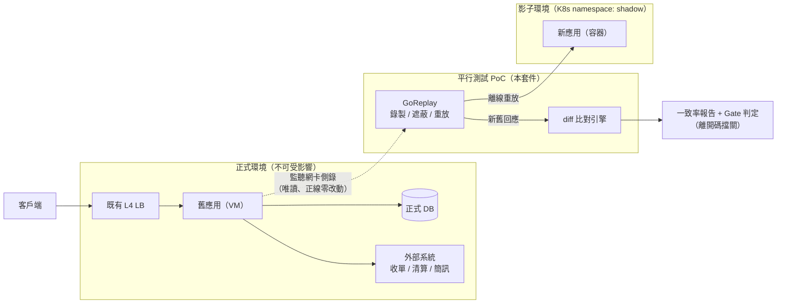
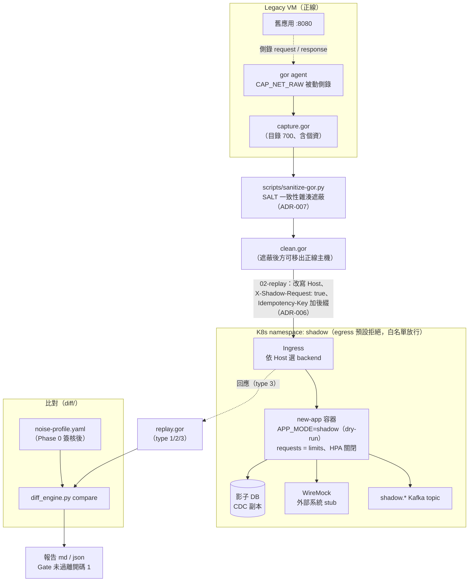
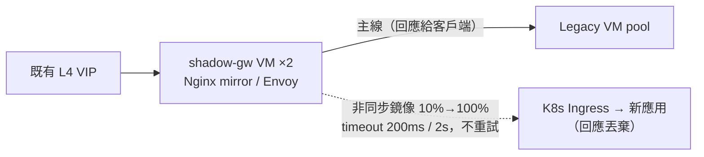
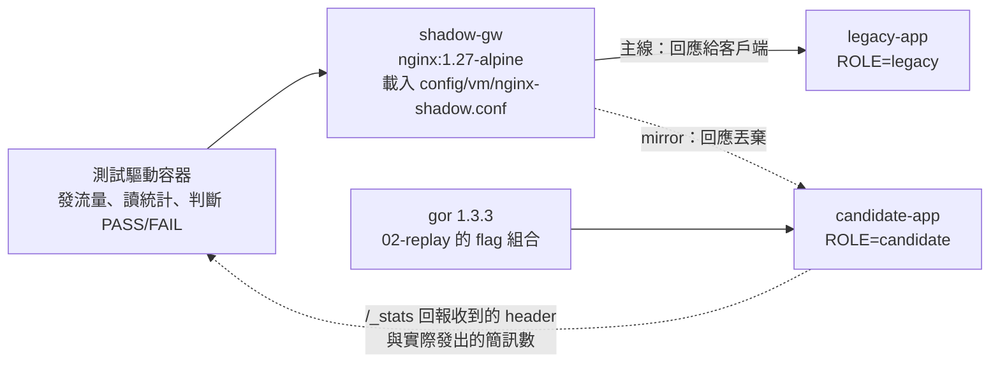

# 新舊應用平行測試 PoC 套件

舊應用（VM）↔ 新應用（容器 / K8s，無 Service Mesh）的功能與性能平行驗證。

---

## 套件結構

```
.
├── README.md                       本檔
├── CLAUDE.md                       給 Claude Code 的專案指引
├── docs/
│   ├── 01-poc-plan.md            主規劃書（架構、階段、風險）
│   ├── 02-work-checklist.md            32 項工作 + Gate 定義
│   ├── 03-verification-report.md       驗證報告（L1–L4 分層結果與發現的缺陷）
│   ├── FILEMAP.md                  檔名對照
│   ├── build-deck.js               管理層簡報生成腳本（pptxgenjs）
│   └── adr/
│       ├── ADR-001-traffic-capture-method.md          錄製重放 vs 即時鏡像
│       ├── ADR-002-shadow-gateway-placement.md      VM 側 vs K8s 側
│       ├── ADR-003-side-effect-isolation.md      三層防護
│       ├── ADR-004-noise-baseline-and-diff.md    Phase 0 設計
│       ├── ADR-005-perf-metric-normalization.md        為何不能直接比 latency
│       ├── ADR-006-header-contract.md            shadow header 規格
│       └── ADR-007-pii-masking-and-retention.md      法遵要求
├── scripts/
│   ├── 00-preflight.sh             跨界連通性驗證（W1 必做）
│   ├── 01-record.sh                legacy VM 錄製
│   ├── 02-replay-functional.sh     1x 重放（功能比對）
│   ├── 03-replay-perf.sh           倍率重放（性能驗證）
│   ├── 04-run-diff.sh              比對 + Gate 判定
│   └── sanitize-gor.py             錄製檔個資遮蔽
├── diff/
│   ├── diff_engine.py              比對引擎（compare / baseline）
│   ├── gor_parser.py               .gor 解析
│   ├── normalizer.py               噪音正規化
│   ├── noise-profile.yaml          噪音設定檔
│   └── selftest.py                 自我測試
├── config/
│   ├── vm/nginx-shadow.conf        VM 側影子閘道（備案）
│   └── k8s/
│       ├── envoy-shadow.yaml       Envoy 影子閘道（備案）
│       └── shadow-namespace.yaml   隔離用 Namespace/Quota/NetworkPolicy/Deployment
├── verify/
│   ├── e2e_verify.py               本機端到端驗證（模擬新舊服務走完全流程）
│   ├── t14-networkpolicy.sh        T-14：影子端 egress 隔離實測（需叢集，含對照組）
│   └── t14-test-pods.yaml          T-14 用測試 Pod（標籤對齊白名單 podSelector）
├── demo/
│   ├── demo-script.yaml            示範影片內容腳本（章節／字幕／指令／輸出）
│   ├── render_demo.py              影片渲染器（Pillow 畫格 → ffmpeg 出 mp4）
│   ├── fontkit.py                  字型與字寬工具（缺字偵測、CJK 斷行、手繪符號）
│   └── README.md                   重跑方式、節奏調整、字型與 ffmpeg 限制
└── dist/
    ├── poc-exec-deck.pptx          管理層簡報（由 docs/build-deck.js 產出）
    ├── poc-exec-deck.pdf           簡報 PDF 版
    └── poc-package.zip             對外交付打包
```

---

## 架構圖

依 C4 Model 分層：C1 系統情境、C2 容器（合併部署視角 —— VM ↔ K8s 混合拓撲與
網路隔離是本案關鍵，屬部署層資訊）。C3 僅 diff 引擎有意義（見 CLAUDE.md 模組表），
不另繪圖。

### C1 系統情境圖



### C2 容器暨部署圖（主方案：GoReplay 錄製重放）



### 備案：VM 側即時鏡像（僅當「即時發現差異」為硬需求，ADR-001/002）



---

## 快速開始

下面 7 個步驟有一支 **6 分 52 秒的操作示範影片**（終端機畫面 + 中文字幕）：

```bash
.venv/bin/pip install pillow pyyaml
.venv/bin/python demo/render_demo.py -o dist/poc-demo.mp4
```

影片不入版控（每次渲染的 blob 都不同），由 `demo/` 隨時可重現。
改文案或節奏只需動 `demo/demo-script.yaml`，改完先跑 `--dry-run` 檢查 ——
詳見 `demo/README.md`。

### 0. 驗證工具本身可用

```bash
cd diff && python3 selftest.py
```

預期輸出：注入 4 筆真實缺陷全數偵測，196 筆噪音全數抑制。

完整流程可用本機端到端驗證（模擬新舊服務，涵蓋遮蔽 / 基線 / 比對 / Gate）：

```bash
python3 verify/e2e_verify.py
```

各項驗證結果見 `docs/03-verification-report.md`；容器層實測方法與發現見下方「驗證」一節。

### 1. W1 跨界連通性（在 legacy VM 上）

```bash
TARGET_HOST=new-app.bank.internal \
XFF_ECHO_PATH=/api/v1/_echo \
./scripts/00-preflight.sh
```

FAIL 為 0 才可繼續。

### 2. 錄製（legacy VM）

```bash
sudo PERCENT=5 DURATION=60m ./scripts/01-record.sh
```

### 3. 遮蔽個資（移出正線主機前必做）

```bash
export SALT=$(cat /etc/shadow-poc/salt)     # 固定值，勿更換
python3 scripts/sanitize-gor.py \
    /data/shadow-capture/legacy_20260725-090000.gor \
    /data/clean/legacy_20260725.gor --report
```

遮蔽報告零命中時**不得放行** —— 代表規則與實際資料格式不符。

### 4. Phase 0 噪音基線（舊 vs 舊）

```bash
# 先重放到 legacy 第二實例
TARGET=http://legacy-2.bank.internal:8080 \
  ./scripts/02-replay-functional.sh /data/clean/legacy_20260725.gor

python3 diff/diff_engine.py baseline \
    --combined /data/shadow-replay/replay_*.gor \
    --profile diff/noise-profile.yaml \
    --out-profile diff/noise-profile.signed.yaml \
    --gate-false-positive 1.0
```

⚠ 產出的 `ignore_paths` 是**候選**，不是結論。逐條人工簽核後才可套用 —— 自動學習會把「排序不穩定的金額欄位」也列進來，那正是真實缺陷會躲藏的位置。

### 5. Phase 1–3 功能比對

```bash
./scripts/02-replay-functional.sh /data/clean/legacy_20260725.gor
PHASE=1 PROFILE=diff/noise-profile.signed.yaml \
  ./scripts/04-run-diff.sh /data/shadow-replay/replay_20260725.gor
```

離開碼 0 = Gate 通過可推進；1 = 停在原階段。

### 6. Phase 4 性能

```bash
LADDER="100 200 500" ./scripts/03-replay-perf.sh /data/clean/legacy_20260725.gor
```

**判準是應用內部 timer，不是端到端 latency**（見 ADR-005）。

---

## 驗證

這一節記錄本套件實際被驗證過什麼、怎麼驗的、以及驗出了什麼問題。
若你是第一次接觸平行測試，建議先讀「名詞速查」與「為什麼要分四層」。

### 名詞速查

| 名詞 | 意思 |
|---|---|
| 舊應用 / legacy | 現行在 VM 上跑的系統，是「正確答案」的來源 |
| 新應用 / 候選端 / candidate | 要汰換上去的容器版系統，是被檢驗的對象 |
| 影子端 / shadow | 新應用所在的隔離環境。收到的是複製的流量，回應**不會**給客戶端 |
| 正線 / 主線 | 真正服務客戶端的路徑。整個 PoC 的第一原則是不能影響它 |
| GoReplay / `gor` | 錄製與重放 HTTP 流量的工具。錄製檔是 `.gor` 格式 |
| `.gor` 的 type | `1`=請求、`2`=舊應用的回應、`3`=新應用的回應。三者靠同一個 uuid 配對 |
| dry-run | 新應用收到 `X-Shadow-Request: true` 時進入的模式：照常運算，但不發簡訊、不呼叫外部、不寫主檔 |
| mirror（鏡像） | 閘道把同一個請求「複製一份」送給影子端，影子端的回應直接丟棄 |
| 噪音 | 新舊兩邊必然不同、但無關正確性的欄位（時間戳、traceId、容器 hostname、陣列順序…） |
| 一致率 | 扣除噪音後，新舊回應完全相同的比例 |
| Gate | 階段推進的門檻。未達標就不准進下一階段，靠腳本離開碼讓 CI 擋關 |
| NetworkPolicy | K8s 的網路防火牆規則。本案用它確保影子端連不到正式資源 |
| CNI | K8s 的網路插件。**NetworkPolicy 由 CNI 執行，CNI 沒實作就等於沒生效** |

### 為什麼要分四層

每一層能抓到的問題種類不同，上一層抓不到的下一層才抓得到。這不是重複工作：

| 層 | 做什麼 | 抓得到 | **抓不到** |
|---|---|---|---|
| L1 靜態檢查 | 語法、YAML 能不能解析 | 打錯字、縮排錯 | 語意錯（欄位名不存在、值格式不合） |
| L2 引擎自我測試 | 用合成資料測比對引擎 | 比對邏輯漏檢/誤報 | 設定檔與外部工具的問題 |
| L3 本機端到端 | 用 Python 模擬新舊應用，跑完整管線 | 管線接不起來、Gate 判定錯 | Nginx / Envoy / gor **本體**的行為（全被模擬掉了） |
| L4 容器實測 | 起真容器，載入真設定、跑真 gor | 載入期錯誤、執行期靜默失效 | 真實負載下的性能與時序 |

**這個分層是有代價才學到的**：L1–L3 全部通過（當時 49/49）的情況下，L4 仍抓出
**12 項缺陷**。兩個最嚴重的都是「表面完全正常」型：

- Nginx 影子閘道**完全沒有在鏡像流量**，而 `nginx -t` 通過、access log 還顯示命中。
- Envoy 把影子 header 加在主路由上，**正線的正式交易也被標成影子請求**而進入
  dry-run（簡訊、外部呼叫、寫檔全部靜默不執行）。設定能正常載入，影子端行為
  也完全正確 —— 只有去量測「正線副作用有沒有照常發生」才會發現。

只看前三層會得到完全錯誤的信心。

### 驗證環境

| 項目 | 值 |
|---|---|
| 平台 | WSL2 / Fedora Linux 44、kernel 6.18.35.2-microsoft-standard-WSL2 |
| Python | 3.14.6 + PyYAML 6.0.3（裝在專案 `.venv`；系統 Python 未內建 PyYAML） |
| 容器 runtime | `wslc` 2.9.4.0（WSL Containers CLI，指令與 Docker 相容） |
| K8s（T-14 用） | kind v0.33 + Docker 29.6.0，叢集 v1.36.1 |
| 使用映像 | `nginx:1.27-alpine`、`envoyproxy/envoy:v1.31-latest`、`python:3.13-alpine`、`alpine:3.20`、`kindest/node:v1.36.1` |
| 外部二進位 | GoReplay 1.3.3（官方最新 release，自報 v1.3.0）、kubeconform 0.8.0 |

使用 `wslc` 時有三個容易卡住的地方：

1. 在 Linux shell 裡**必須打 `wslc.exe`**（它是 Windows 執行檔，經 WSL interop 呼叫），純 `wslc` 會 command not found。
2. `-v` 掛載直接吃 WSL 的 Linux 路徑，**不需要**`wslpath` 轉換。
3. **`-p` 發佈的埠是映射到 Windows 端的 loopback，不是這個 WSL 發行版。** 從 WSL 內 `curl 127.0.0.1:<port>` 連不到，容器 IP 也不能直連 —— 所以測試客戶端一律放進同一個容器網路內跑。

另外 `wslc run` 沒有 `--privileged`／`--cap-add`，需要特權的驗證（kind、
`gor --input-raw`）要走 Docker。

### L1 靜態檢查

```bash
bash -n scripts/*.sh                                    # shell 語法
.venv/bin/python -m py_compile diff/*.py scripts/sanitize-gor.py verify/e2e_verify.py
.venv/bin/python -c "import yaml,sys; [list(yaml.safe_load_all(open(f))) for f in sys.argv[1:]]" \
    diff/noise-profile.yaml config/k8s/envoy-shadow.yaml config/k8s/shadow-namespace.yaml
```

沒有輸出就是通過。結果：6 支腳本語法通過、7 份 YAML 文件可解析。

### L2 比對引擎自我測試

```bash
cd diff && ../.venv/bin/python selftest.py
```

它會自己造一份含**已知噪音**與**已知缺陷**的假錄製檔，然後檢查引擎有沒有
「該抑制的抑制、該抓的抓到」。預期輸出：

```
OK - 4 real defects detected, 196 noisy responses correctly suppressed
```

怎麼讀：`4 real defects detected` 代表沒有漏檢，`196 noisy responses
correctly suppressed` 代表沒有誤報。兩個數字任一不對就是引擎壞了。

### L3 本機端到端

```bash
.venv/bin/python verify/e2e_verify.py --out-json tmp-verify/results.json
```

它在本機起三個 HTTP 服務分別扮演「舊應用」「舊應用第二實例」「新應用」，
然後把 錄製 → 遮蔽 → Phase 0 基線 → Phase 1 比對 → Gate 判定 整條管線真的跑一遍。
`sanitize-gor.py`、`gor_parser`、`normalizer`、`diff_engine`、`00`/`04` 腳本
**都是實際執行**，只有「搬運流量」那一層用等價的 Python 重放器代替。

結果：**60 / 60 通過**（含本次為防止缺陷復發而新增的 11 項回歸檢查）。
最後一行會是：

```
 驗證結果：60/60 通過
```

### L4 容器實測（wslc）

#### 拓撲



`legacy-app` 與 `candidate-app` 是同一支模擬應用，用環境變數 `ROLE` 決定行為，
並額外提供 `/_stats` 端點。**關鍵設計：header 契約與副作用隔離是由影子端
自己回報的，不是從閘道的設定推論的** —— 否則就變成「檢查設定檔寫了什麼」，
那正是 L1 已經做過而且不夠的事。

#### 方法：測試設定由專案原檔程式化產生

如果手寫一份「類似」的 nginx 設定來測，測到的就不是專案的設定。因此容器用的
設定是從 `config/vm/nginx-shadow.conf` 以腳本替換產生，**只改環境綁定**，共 19 行：

| 替換 | 為什麼要改 |
|---|---|
| `upstream legacy_vm` → `legacy-app:8080` | 測試環境沒有 VM |
| `upstream new_k8s` → `candidate-app:8080` | 測試環境沒有 K8s Ingress |
| 影子線 `https` → `http`、移除 `proxy_ssl_*` 四行 | 測試環境沒架內部 CA |
| `split_clients` 比例 10% →100%（另備 10% 版） | 契約測試需要每筆都鏡像才能逐項檢查 |
| 補 `map $http_upgrade`（原檔依賴外層定義） | 原檔是 http-context 片段，不是完整 nginx.conf |

**完全未改**：`mirror` / `mirror_request_body` / 所有 `proxy_set_header` /
所有 `proxy_*_timeout` / `proxy_next_upstream` / `internal` / `split_clients` 結構。
這些正是要驗的東西。

#### C1　Nginx 設定實載

```bash
wslc.exe run --rm -v "$PWD/config/vm/nginx-shadow.conf:/etc/nginx/conf.d/default.conf" \
  nginx:1.27-alpine sh -c '
    mkdir -p /etc/nginx/ca && cp /etc/ssl/certs/ca-certificates.crt /etc/nginx/ca/internal-ca.pem
    echo "127.0.0.1 k8s-ingress.internal" >> /etc/hosts
    nginx -t'
```

結果：nginx **1.27.5** 載入通過，`ngx_http_mirror_module` 確認編入
（原檔宣稱需要 ≥ 1.13.4，成立）。

初學者容易踩的兩點 —— `nginx -t` 不只檢查語法，**它會在載入期做這兩件事**，
少了就會失敗（所以上面那兩行前置不是多餘的）：

- `proxy_ssl_trusted_certificate` 指向的 PEM 檔必須真的存在
- `upstream` 裡的主機名必須能解析（`k8s-ingress.internal`）

#### C2　Envoy 設定實載

```bash
wslc.exe run --rm -v "$PWD/config/k8s/envoy-shadow.yaml:/etc/envoy/shadow.yaml" \
  envoyproxy/envoy:v1.31-latest envoy --mode validate -c /etc/envoy/shadow.yaml
```

**修正前：無法載入**（兩個硬錯誤，見「發現的缺陷」#1、#2）。
修正後：`configuration ... OK`，且警告數 0。

但**能載入不等於行為正確** —— 這一項只證明設定合法。Envoy 的實際鏡像行為
另外用真 Envoy 打流量驗證（見 C7），而那裡抓到了兩個更嚴重的問題。

#### C3　端到端鏡像行為（11 項）

```bash
wslc.exe run --rm --network poc-net -v "$SCRATCH:/work" python:3.13-alpine \
  python /work/drive.py contract 40
```

| 檢查 | 結果 |
|---|---|
| 主線全部 200、回應一律來自 legacy（客戶端感受不到鏡像存在） | ✅ `hostname=vm-legacy-01` |
| 影子端收到全部 40 筆（mirror 生效） | ✅ 40/40（穩態；冷啟動見下方觀察） |
| Host 已改寫為 `new-app.bank.internal` | ✅ 40/40 |
| `X-Shadow-Request: true`、`X-Origin-Platform: vm`、`Accept-Encoding: identity` | ✅ 零違規 |
| `Idempotency-Key` 加 `-shadow` 後綴 | ✅ 18/18 |
| `traceparent` 已清空（APM 兩條 trace 不互相污染） | ✅ |
| **副作用隔離**：正線發 20 筆簡訊、影子端發 **0** 筆 | ✅ ADR-003 成立 |
| 鏡像比例 `split_clients` 設 10% 時的實際比例 | ✅ 20/200 = 10.0% |

Host 改寫這項為什麼重要：混合拓撲下 K8s Ingress 是**依 Host/SNI 選 backend**，
Host 沒改寫就會 404，而報告上會表現成「新應用大量 4xx」，很容易被誤判成
應用缺陷 —— 這是本套件反覆強調的第一號陷阱。

#### C4　影子端會不會拖累正線

這是 CLAUDE.md 約束 #4 的核心主張，用三組對照量測（每組 30 筆，影子端一律
**先啟動再啟閘道**，否則 nginx 會在啟動時解析到舊 IP 而測錯）：

| 設定 | median | p95 | max | 影子端收到 |
|---|---|---|---|---|
| A 鏡像關閉（基準線） | 1.7ms | 44.2ms | 44.6ms | 0 |
| B 鏡像 100% + 影子端健康 | 1.3ms | 47.8ms | 48.1ms | 24/30 |
| C 鏡像 100% + **影子端刻意延遲 5s** | 1.5ms | 44.2ms | 44.2ms | 30/30 |

C 組的影子端確實收到全部 30 筆（`shadow_requests=30`、`sms_sent=0`），
但主線延遲與「完全不鏡像」無可測差異。

**這推翻了原本寫在 CLAUDE.md 的理由**（「Nginx 主連線在子請求結束前不會釋放」）。
結論不變 —— timeout 仍然不得放寬 —— 但**理由要改成資源佔用**：子請求會綁住
worker 與 upstream 連線，timeout 放長會在影子端變慢時累積連線，最終才傷到正線。
理由寫錯很危險，因為它會被拿來論證「既然主線不等，那 timeout 可以放寬」。

#### C5　真 GoReplay 錄製重放

`01-record.sh` 用 `--input-raw` 直接監聽網卡，需要 `CAP_NET_RAW`，而 `wslc run`
沒有這個開關。因此錄製改以應用層產生**格式相同**的 `.gor`（格式常數直接
`import` 專案的 `diff/gor_parser.PAYLOAD_SEPARATOR`，確保格式定義一致），
再交給真 gor 重放：

```bash
wslc.exe run --rm --network poc-net -v "$SCRATCH:/work" alpine:3.20 sh -c '
/work/gor --input-file /work/capture.gor --input-file-loop=false \
  --output-http "http://candidate-app:8080" --output-http-track-response \
  --output-http-workers 20 --output-http-timeout 5s --output-http-response-buffer 10mb \
  --http-set-header "Host: new-app.bank.internal" \
  --http-set-header "X-Shadow-Request: true" \
  --http-set-header "X-Origin-Platform: vm" \
  --http-set-header "Accept-Encoding: identity" \
  --http-rewrite-header "Idempotency-Key: ^(.+)$,\$1-shadow" \
  --output-file /work/replay.gor --stats --exit-after 15s'
```

結果：

- `02-replay-functional.sh` 的 flag **全部有效**；`01-record.sh` 有 2 個不存在（#7，已修正）
- 真 gor 正確套上 header 契約：影子端 60/60 收到、契約零違規、`sms_sent=0`
- 真 gor 的輸出可被專案 `gor_parser` 解析：type1=60 / type2=59 / type3=60
- 接上專案 `04-run-diff.sh`：**59/59 一致，一致率 100%，Gate 全數通過** ——
  噪音（`hostname` / `timestamp` / `traceId`）被 `diff/noise-profile.yaml` 全數抑制

這一項的意義：它是唯一一條「真工具 → 真設定 → 真引擎」的完整鏈路，
證明三者的格式與契約真的能接起來，而不只是各自單獨可用。

#### C6　K8s manifest schema 驗證

`kubectl apply --dry-run=client` **在沒有叢集時不可用** —— 它仍需連上 API server
做 discovery（實測會卡在 `couldn't get current server API group list`）。
離線要用 schema 驗證器：

```bash
kubeconform -summary -strict config/k8s/shadow-namespace.yaml
```

結果：5 / 5 資源皆 valid（Namespace、ResourceQuota、2 個 NetworkPolicy、Deployment），
`-strict` 亦無未知欄位。

#### C7　Envoy 執行期實測（真 Envoy 打流量）

`--mode validate` 只證明設定合法。這一項起真 Envoy 當閘道，把同一套契約測試
（C3 的 11 項）跑一遍，設定同樣由專案原檔程式化產生，只改 4 處環境綁定
（legacy/ingress 位址、鏡像比例 10→100、admin 綁 0.0.0.0）：

```bash
wslc.exe run -d --name envoy-gw --network poc-net \
  -v "$SCRATCH/envoy-test.yaml:/etc/envoy/envoy.yaml" \
  envoyproxy/envoy:v1.31-latest envoy -c /etc/envoy/envoy.yaml
wslc.exe run --rm --network poc-net -e GW=envoy-gw:8080 -v "$SCRATCH:/work" \
  python:3.13-alpine python /work/drive.py contract 30
```

**第一次跑：8/11，抓到兩個缺陷（#11、#12）。** 修正後 **11/11 通過**，與 Nginx
路徑完全一致：影子端 30/30 收到、Host 改寫正確、`Idempotency-Key` 加後綴、
`traceparent` 清空、影子端簡訊 0 筆、**正線簡訊 15 筆照發**。

其中 #12 值得單獨說明，因為它示範了「為什麼要量測正線」：

Envoy 原本把影子 header 寫在**主路由**的 `request_headers_to_add` 上。
route 層的 header 操作會作用在**被路由的那個請求**，也就是主線請求 ——
於是正式交易也帶著 `X-Shadow-Request: true` 打進舊應用，舊應用就進了 dry-run。
實測數字：正線 30/30 被標成影子請求，簡訊 0 筆（應為 15）。

而影子端那邊**一切正常**（收到 30/30、header 齊全、簡訊 0），設定也能正常載入。
所以只檢查「影子端有沒有正確收到」永遠發現不了這個問題 —— 必須同時量測
「正線的副作用有沒有照常發生」。修法是把影子 header 全部移到
`shadow_host_rewrite`（internal listener）的路由上，只有鏡像流量會經過那裡。

### T-14：影子端 egress 隔離實測（Gate 阻擋項）

這是檢核表裡的 Gate 阻擋項，也是「影子端絕不可連到正式資源」那道防線。
本套件現在附了可重跑的驗證工具：

```bash
kind create cluster --name shadow-poc
kubectl apply -f config/k8s/shadow-namespace.yaml
./verify/t14-networkpolicy.sh              # 驗證
./verify/t14-networkpolicy.sh --cleanup    # 清掉測試 Pod
```

#### 為什麼不能只看 `kubectl get networkpolicy`

**NetworkPolicy 是宣告，執行它的是 CNI。** CNI 若沒有實作 NetworkPolicy，
`kubectl get networkpolicy` 一樣顯示規則存在、`apply` 一樣成功，但所有流量照通。
這是整個 PoC 最危險的假通過之一 —— 防線在無聲中失效，而所有表面訊號都正常。
`config/k8s/shadow-namespace.yaml` 檔頭那句「不可只看設定檔就當作生效」講的就是這件事。

#### 測試設計：每個「應被擋」都要有對照組

若只測「影子端連不到外網」，連不通可能有兩種原因：policy 擋住了，或那條路
本來就不通。兩者在結果上長得一樣，但意義完全相反。因此本工具在 `shadow`
namespace **之外**放一個不受 policy 管的對照 Pod：**對照組通、受管 Pod 不通，
才能證明阻斷是 policy 造成的。**

阻斷用「逾時無回應（BLOCKED）」與「立即拒絕（REFUSED）」區分：前者是封包被
丟棄，是 NetworkPolicy 的典型行為；後者代表封包有到達對端、只是沒服務在聽，
那是測試環境問題而不是隔離生效。

#### 結果：12 / 12 符合預期

| 測試對象 | 項目 | 期望 | 實得 |
|---|---|---|---|
| 對照組（default ns） | 連 shadow-db:5432 / not-whitelisted:8080 / 外網 | 通 | ✅ 三項全通 |
| `app=new-app`（白名單對象） | 影子 DB TCP 5432 | 放行 | ✅ OPEN |
| | WireMock stub TCP 8080 | 放行 | ✅ OPEN |
| | DNS（kube-system:53） | 放行 | ✅ OK |
| | 未列白名單的同 namespace Pod | 阻斷 | ✅ BLOCKED |
| | 外部網路（模擬收單/清算/簡訊） | 阻斷 | ✅ BLOCKED |
| | 白名單 Pod 的**非放行埠** | 阻斷 | ✅ BLOCKED |
| `app=rogue`（不符任何放行規則） | 影子 DB | 阻斷 | ✅ BLOCKED |
| | DNS | 阻斷 | ✅ BLOCKED |
| | 外部網路 | 阻斷 | ✅ BLOCKED |

兩點值得注意：

- **白名單是「Pod + 埠」的組合**，不是只認 Pod。連白名單 Pod 的非放行埠也會被擋。
- **`default-deny-egress` 涵蓋 namespace 內所有 Pod**：`app=rogue` 這種不符任何
  放行規則的 Pod 連 DNS 都不通。這正是預設拒絕該有的行為 —— 新增 Pod 若忘了
  配對應的放行規則，它會**完全不能連外**，而不是悄悄獲得全通。

#### 關於 CNI 的實測結論

同一組 policy 在兩種 CNI 上各跑一次，**都是 12/12**：

| CNI | 版本 | 結果 |
|---|---|---|
| kindnet（kind 預設） | `kindest/kindnetd:v20260528` | ✅ 12/12 —— 現版已實作 NetworkPolicy |
| Calico | v3.32.1（`disableDefaultCNI: true` 後安裝） | ✅ 12/12 |

所以在目前的 kind 上，`kind create cluster` 直接就能驗 T-14，不必換 CNI。
但**較舊的 kindnetd 並未實作 NetworkPolicy**，換一個叢集、換一版就可能不同 ——
這恰恰是「必須實測而非假設」的理由。若 `t14-networkpolicy.sh` 回報「阻斷」項
**全數**失敗（實得 OPEN），第一個要懷疑的就是 CNI。

真正的 `new-app` Deployment 在 kind 上會停在 `ImagePullBackOff` / `Pending`
（私有 registry 映像 + 每個 replica 4 CPU），這是預期的；T-14 驗的是 policy，
所以用貼相同標籤的輕量測試 Pod 代替。另外因為 `shadow` namespace 有
ResourceQuota 約束 requests/limits，**測試 Pod 必須明確宣告資源**，否則會被
quota 直接拒絕建立。

### 發現的缺陷

L1–L3 全部通過的情況下，L4 抓出以下問題。**#1–#8 已修正並重新驗證通過**；
每一項都附上當初的證據，方便日後回頭確認。

| # | 檔案 | 問題 | 證據 | 狀態 |
|---|---|---|---|---|
| 1 | `config/k8s/envoy-shadow.yaml` | `connect_timeout: 200ms` 不是合法的 protobuf Duration，須寫 `0.2s`；整份 bootstrap 解析失敗 | `duration must end with a single 's'` | ✅ 已修正 |
| 2 | 同上 | `host_rewrite_literal` 不是 `Cluster` 的欄位（那是 `RouteAction` 的），Envoy 以 unknown field 拒絕載入 | `no such field: 'host_rewrite_literal'` | ✅ 已修正 |
| 3 | 同上 | 註解宣稱要覆寫 Envoy 自動加的 `-shadow` Host 後綴，但原寫法達不到。合法組合：mirror policy 加 `disable_shadow_host_suffix_append: true`＋internal listener 於 route 層做 `host_rewrite_literal`＋註冊 `envoy.bootstrap.internal_listener` | 直接注入 Host 被拒：`:-prefixed or host headers may not be modified` | ✅ 已改為此組合 |
| 4 | 同上 | `FileAccessLog.json_format` 已 deprecated（須包在 `log_format` 下）；`use_remote_address` 下未設 `internal_address_config` | envoy validate warning ×2 | ✅ 已修正，警告 0 |
| 5 | `config/vm/nginx-shadow.conf` | **`mirror $mirror_uri;` —— `mirror` 指令不支援變數。** nginx 把 `$mirror_uri` 當字面 URI，鏡像**完全不生效**（影子端 0 筆），每筆請求還多噴 2 行 error log。而 `nginx -t` 通過、access log 顯示 `"shadow":"on"`，外部完全看不出來 | `subrequest: "$mirror_uri"`、`open() "/etc/nginx/html$mirror_uri" failed` | ✅ 改為 `mirror /shadow;`＋比例判斷移入該 location |
| 6 | `CLAUDE.md` 約束 #4 | 理由「主連線在子請求結束前不會釋放」實測不成立（見 C4）。結論不變但理由需改寫，否則會被誤用來論證放寬 timeout | C4 三組對照 | ✅ 已改為資源佔用理由 |
| 7 | `scripts/01-record.sh` | `--output-file-max-size` 與 `--output-file-stats` 在 gor 1.3.3 不存在，腳本會立刻失敗、錄不到任何東西。正確為 `--output-file-max-size-limit`；錄製端統計是 `--input-raw-stats` | `flag provided but not defined: -output-file-max-size` | ✅ 已修正 |
| 8 | `scripts/02-replay-functional.sh` | gor 會在副檔名前插入 chunk 序號（`replay.gor` → `replay_0.gor`），腳本末尾提示的下一步指令指向不存在的檔案 | 實測產出 `replay_0.gor` | ✅ 改為取實際檔名 |
| 9 | `scripts/04-run-diff.sh` | 預設用**端到端 latency** 擋 Gate，與 ADR-005／約束 #5 衝突（報告自身註記即寫著 `Gate on in-application timers instead`）。實測一致率 100% 卻因 P99 比 37×（1.3ms vs 48.6ms）被擋 | `GATE FAILED: latency_p99_ratio` | ✅ `LATENCY_RATIO` 預設改為 0（僅列參考值），要擋須明確指定 |
| 10 | 同上 | 引擎因缺依賴 traceback 時，訊息誤報為「Gate 未通過 → 請人工複核差異樣本」，還列出不存在的報告檔 | 以無 PyYAML 的 python3 執行時重現 | ✅ 新增離開碼 2 =「引擎未完成」，訊息與 Gate 判定分開 |
| 11 | `config/k8s/envoy-shadow.yaml` | **影子 header 加在主路由上，正線的正式交易也被標成影子請求而進入 dry-run** —— 簡訊、外部呼叫、寫檔全部靜默不執行。設定能正常載入、影子端行為也完全正確，只有量測正線副作用才會發現（見 C7） | 正線 30/30 收到 `X-Shadow-Request: true`，簡訊 0 筆（應為 15）| ✅ 影子 header 全部移到 internal listener 的路由 |
| 12 | 同上 | Envoy 路徑未實作 ADR-006 的兩項：`Idempotency-Key` 沒加 `-shadow` 後綴、`traceparent` 沒清空（Nginx 路徑兩者都有）。兩條備案路徑契約不一致 | 影子端回報 `Idempotency-Key 未加後綴`、`traceparent 未清空` | ✅ 以 `%REQ(IDEMPOTENCY-KEY)%-shadow` + `OVERWRITE_IF_EXISTS` 與 `request_headers_to_remove` 補上 |

修正後重新驗證：nginx `-t` 通過且鏡像實際生效（穩態 40/40）、Envoy validate
OK 且 0 警告、**Envoy 執行期契約測試 11/11**（與 Nginx 路徑一致）、gor flag 全部
被接受、`04-run-diff.sh` 三種離開碼（0/1/2）行為正確、T-14 兩種 CNI 各 12/12、
L3 由 49/49 提升到 **60/60**（新增 11 項針對上述缺陷的回歸檢查，避免復發）。

### 觀察到但無法穩定重現的現象

修好 #5 之後，影子子請求出現**靜默逾時損失**：閘道啟動後第一輪固定掉 3–6 筆
（分屬不同 nginx worker、同一秒、卡在 `while sending to client` 滿 2s），
之後穩態 0 損失。因 `proxy_next_upstream off` 不重試，這些流量**只在 error log
留痕**，直接造成比對樣本缺漏。

另外真 gor 的檔案輸出掉了 1/120 筆訊息（輸入 60 個 type-2、輸出 59 個），
造成 59/60 可配對。

兩者都不影響本次結論（缺的是樣本、不是判定），但在真實環境**必須對帳**：
比較「錄製筆數」與「影子端實收筆數」，差異超過門檻要當成資料品質問題處理，
而不是默默用少掉的樣本算一致率。

### 仍未能實測的項目

| 項目 | 原因 | 對應檢核 |
|---|---|---|
| `gor --input-raw` 實際錄製 | 需 `CAP_NET_RAW`，`wslc run` 無此開關；錄製改以應用層產生等價 `.gor` | T-10 |
| 影子線 TLS（`proxy_ssl_*`、SNI、內部 CA 驗證） | 測試環境未架內部 CA，實測時已移除該四行 | R7 |
| CDC 實際延遲分布、gor CPU 佔用、正線 P99 增幅 | 需真實環境與真實負載 | T-11、T-21、T-24 |
| Envoy 的 `runtime_key` 熱調與緊急回退（admin API 改 `shadow.mirror_fraction`） | 只驗證了設定欄位存在與 100% 生效，未實測熱調過程 | R7 |
| K8s Ingress 依 Host/SNI 選 backend 的實際行為 | 測試以「影子端檢查收到的 Host」代替真 Ingress 路由 | T-12 |

### 重跑方式

```bash
# 前置
python3 -m venv .venv && .venv/bin/pip install pyyaml

# L1–L3
bash -n scripts/*.sh
(cd diff && ../.venv/bin/python selftest.py)
.venv/bin/python verify/e2e_verify.py

# L4：設定檔實載（需 WSL 2.9+ 的 wslc；用 Docker 的話把 wslc.exe 換成 docker）
wslc.exe run --rm -v "$PWD/config/vm/nginx-shadow.conf:/etc/nginx/conf.d/default.conf" \
    nginx:1.27-alpine sh -c '
      mkdir -p /etc/nginx/ca && cp /etc/ssl/certs/ca-certificates.crt /etc/nginx/ca/internal-ca.pem
      echo "127.0.0.1 k8s-ingress.internal" >> /etc/hosts && nginx -t'
wslc.exe run --rm -v "$PWD/config/k8s/envoy-shadow.yaml:/etc/envoy/shadow.yaml" \
    envoyproxy/envoy:v1.31-latest envoy --mode validate -c /etc/envoy/shadow.yaml
kubeconform -summary -strict config/k8s/shadow-namespace.yaml

# ⚠ 上面只驗證「設定合法」。改動閘道設定後**務必**再跑一次 C3 / C7 的
#   契約測試（起真閘道打流量），並且必須同時量測「正線副作用有沒有照常發生」
#   —— 缺陷 #5 與 #11 都是設定合法、影子端也正常，只有實跑才看得出來。

# T-14：egress 隔離實測
kind create cluster --name shadow-poc
kubectl apply -f config/k8s/shadow-namespace.yaml
./verify/t14-networkpolicy.sh
```

C3–C5 使用的模擬應用、測試驅動與設定產生器產生於暫存目錄、不入版控；
方法與替換清單如上，可依此重建。T-14 的工具則已收進 `verify/`。

---

## 五件最容易出錯的事

前三件是設計層面的陷阱，後兩件是本次容器實測真的踩到的。共同特徵是
**表面訊號全部正常，錯誤卻在無聲中發生** —— 這類問題只能靠實測抓出來。

1. **Host header 沒改寫** → K8s Ingress 依 SNI/Host 選 backend，回 404，報告上表現為「新應用大量 4xx」，容易誤判為應用缺陷。
2. **拿端到端 latency 直接比** → cgroup 節流、JVM 容器感知、多一跳網路會讓容器版看起來較慢，得出錯誤結論。
3. **把自動學來的 ignore_paths 直接套用** → 這是唯一會讓 PoC「看起來成功但實際失敗」的路徑，也是最難事後發現的。
4. **以為設定檔載入成功就等於行為正確** → `mirror $var;` 讓 nginx 完全不鏡像，但 `nginx -t` 通過、access log 還顯示命中（見「發現的缺陷」#5）。設定改動必須用真二進位實載並打流量驗證。
5. **以為 NetworkPolicy 套用成功就等於擋得住** → 執行 policy 的是 CNI，CNI 沒實作時 `kubectl get networkpolicy` 一樣顯示規則存在而流量全通。必跑 `verify/t14-networkpolicy.sh`（含對照組）。

---

## 依賴

**核心（跑管線必要）**

- Python 3.9+、PyYAML
- GoReplay（`gor`）—— 錄製需 root 或 `CAP_NET_RAW`；flag 名稱已對 **1.3.3** 驗證
- （備案）Nginx ≥ 1.13.4（需 `ngx_http_mirror_module`）或 Envoy ≥ 1.31

**驗證用（選配，僅重跑驗證時需要）**

- 容器 runtime：`wslc` 2.9+ 或 Docker —— 用於設定檔實載驗證
- `kind` + Docker —— 用於 T-14 egress 隔離實測（需特權容器，`wslc` 不支援）
- `kubeconform` —— K8s manifest 離線 schema 驗證（`kubectl --dry-run=client` 無叢集時不可用）
